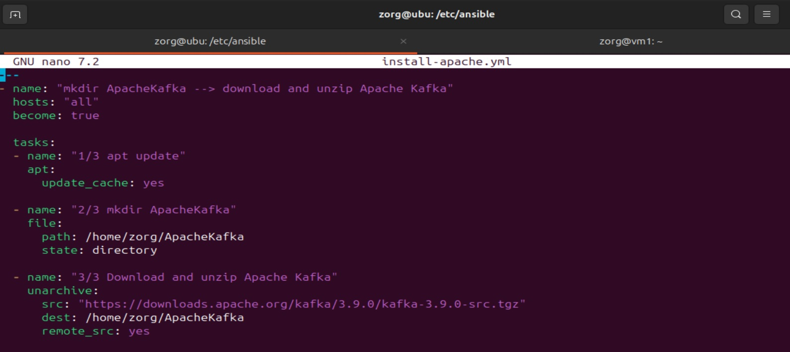
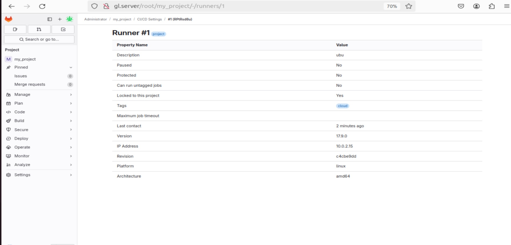
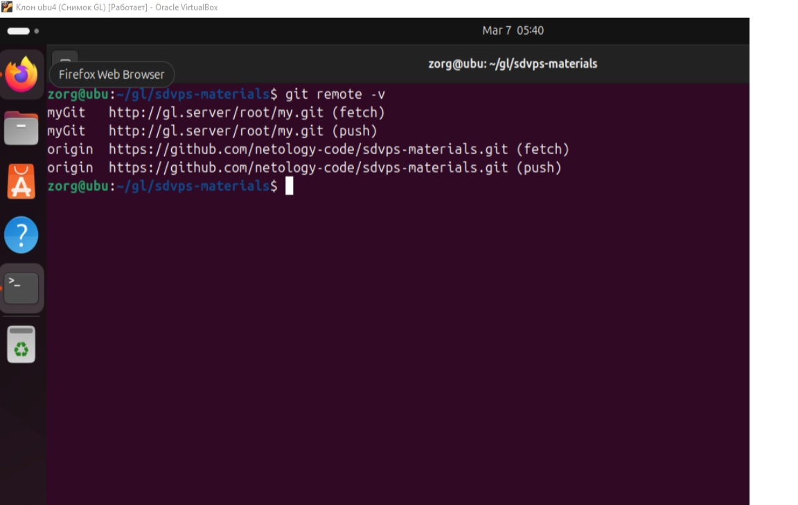
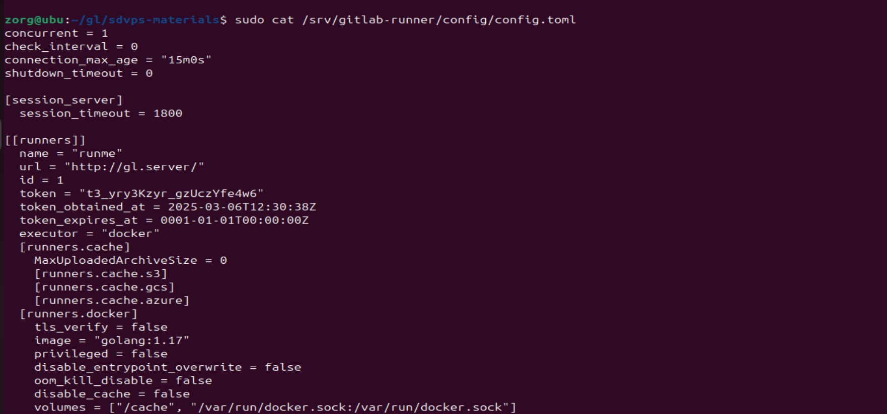
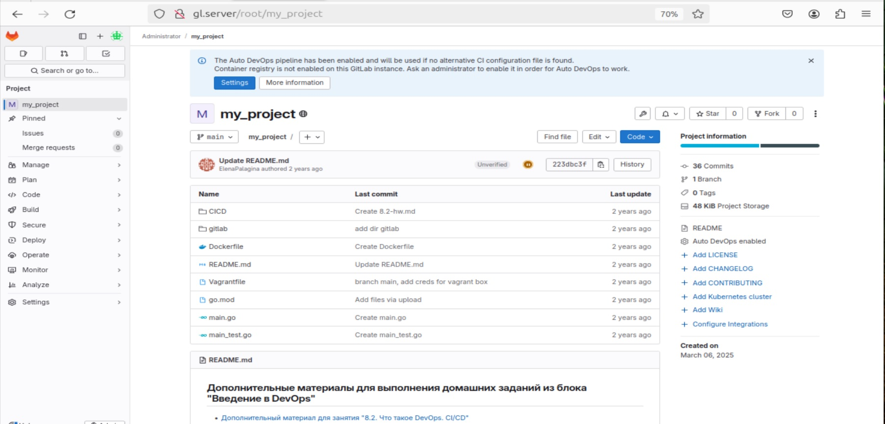
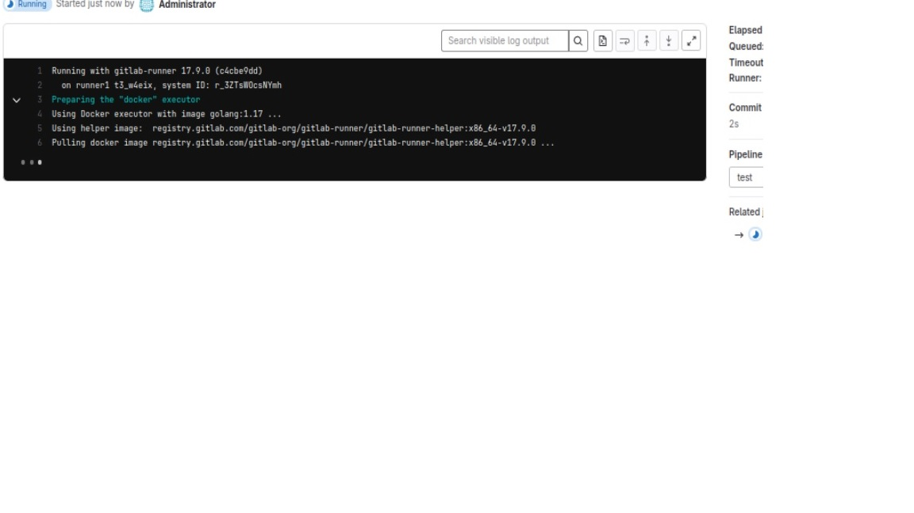
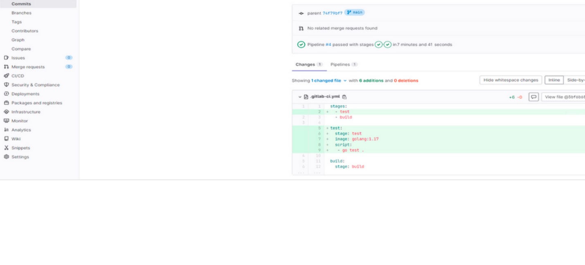

# Домашнее задание к занятию "`Что такое DevOps? CI/CD`" - `IVA`


---

### Задание 1

Разверните GitLab локально, используя Vagrantfile и инструкцию, описанные в этом репозитории.
Создайте новый проект и пустой репозиторий в нём.
Зарегистрируйте gitlab-runner для этого проекта и запустите его в режиме Docker. Раннер можно регистрировать и запускать на той же виртуальной машине, на которой запущен GitLab.





---

### Задание 2
Запушьте репозиторий на GitLab, изменив origin. Это изучалось на занятии по Git.
Создайте .gitlab-ci.yml, описав в нём все необходимые, на ваш взгляд, этапы.











---

### Задание 3


```

